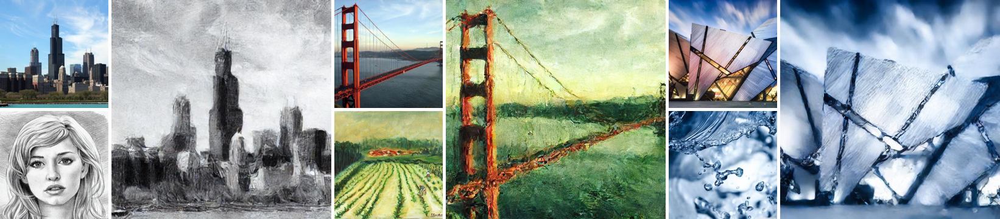
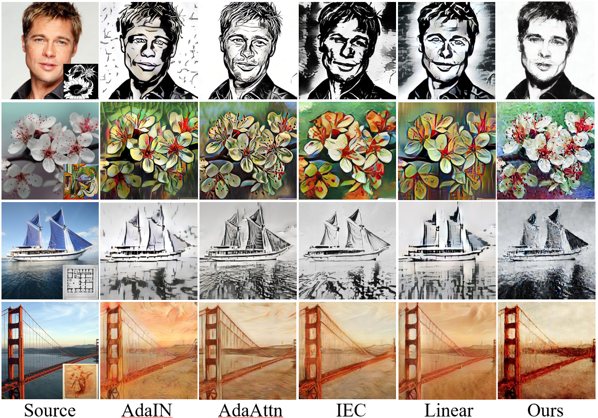

<h1 align = "center">Zero Shot Arbitrary Style Transfer via Diffusion Attention Mapping</h1>




## Description

The input content image and style image can realize arbitrary style transfer, and the whole process does not require training

## Environment

```
conda env create --name cross_style_transfer
conda activate cross_style_transfer
pip install - r requirements.txt
```

## Run

To generate an Image, you can simply run the run.py script. For example

```
python run.py \
--app_image_path /path/to/appearance/image.png \
--struct_image_path /path/to/structure/image.png \
--output_path /path/to/output/images.png \
```



## Acknowledgment

### Our code is based on code from the following paper:

Cross-Image Attention for Zero-Shot Appearance Transfer.([**github**](https://github.com/garibida/cross-image-attention))

